# Mikhail Fetisov — Game Designer (Systems / Content / 3C)

<!--
This repository hosts my personal resume and portfolio site, available at:  
👉 [https://blackjackinbox.github.io](https://blackjackinbox.github.io)
-->

## About Me
Experienced Game Designer with a strong background in **systems, content, and 3C design**.
Hands-on experience with Unity and Unreal Engine projects, including porting, localization, and gameplay mechanics refinement.
Passionate about creating engaging player experiences and improving development workflows.

**Age**: 35

**Location**: Moscow, willing to relocate

**Languages**

- Russian (native)
- English (C1)
- Japanese (JLPT N3)

**Game Preferences**

I draw inspiration from **2D platformers, CRPGs, and strategy games**.  
Favorite titles include:

- *Hollow Knight* — level & world structure, tight 2D combat loop
- *The Witcher 3* — narrative design and meaningful player choices
- *Heroes of Might and Magic III / Frostpunk / Against the Storm* — macro decision-making and systemic storytelling

**Hobbies**:
Outside of Game Design, I play drums in a music band — teamwork, rhythm and iteration are also part of my creative process.

---

## Focus Areas
- System, content, and 3C design
- Gameplay mechanics balancing and refinement
- PC and web-based games (action, strategy, metroidvania)
- International collaboration and localization projects

---

## Resume
📄 [Download my CV (PDF)](CV_Mikhail_Fetisov.pdf)

---

## Case Studies

### Game Design Projects

  
<strong>Dungeon Dominator</strong> — System Designer / Content Designer, UE5

  <h4>About the Project:</h4>
  

    A fantasy <strong>Dungeon management</strong> game developed in Unreal Engine 5 for PC. 
    Designed from a side-view, "ant-farm" perspective, focusing on base-building, exploration, and tactical encounters. 
    Currently in active production, developed by a small core team.
  

  <h4>Role and Responsibilities:</h4>
  <ul>
    <li>System design: core player interaction, meta-progression, economy, and event logic</li>
    <li>Structured and maintained game design documentation</li>
    <li>Created balance sheets and coordinated integration between content and UI</li>
  </ul>

  <h4>Results:</h4>
  <ul>
    <li>Created clear, consistent documentation for complex gameplay systems and content features</li>
    <li>Improved overall design clarity and team communication</li>
  </ul>

  <h4>Project Materials</h4>
  

    Publicly available gameplay footage and visual materials — including results of my design work — can be found on the official Telegram channel: 
    <a href="https://t.me/ShelterDungeongame" target="_blank">https://t.me/ShelterDungeongame</a>
  

  
<strong>Vivo entre Los Muertos (VeLM)</strong> — System Designer / Level Designer / Project Manager, Unity

  <h4>About the Project</h4>
  

    A 2D side-scrolling <strong>metroidvania</strong> inspired by <em>Pitfall</em>, <em>Ori</em>, and <em>Hollow Knight</em>, set in a <strong>Mesoamerican-inspired world</strong>. 
    Developed in Unity as a passion project without external funding. 
    The design included seven planned biomes, multiple boss encounters, and an emphasis on exploration and environmental storytelling.
  

  <h4>Role and Responsibilities</h4>
  <ul>
    <li><strong>System Design:</strong> designed progression systems, player abilities, combat and resource mechanics</li>
    <li><strong>Level Design:</strong> created side-scrolling maps and gameplay flow for exploration and combat areas</li>
    <li><strong>Project Management:</strong> coordinated a small distributed team of artists and programmers, maintained development roadmap, feature priorities, and production milestones</li>
  </ul>

  <h4>Results</h4>
  <ul>
    <li>Completed a nearly finished <strong>vertical slice prototype</strong> showcasing core gameplay</li>
    <li>Fully developed and content-complete biome <strong>“House of Fire”</strong> with unique mechanics and visual identity</li>
  </ul>

<h4>Project Materials</h4>

Screenshots and gameplay videos from the prototype:

  <a href="images/photo_2023-06-26_15-11-11.jpg" target="_blank">
    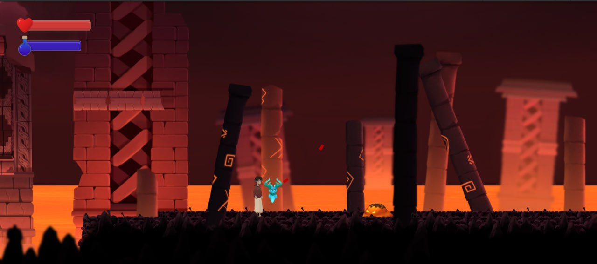
  </a>
  <a href="images/photo_2024-03-14_19-17-08.jpg" target="_blank">
    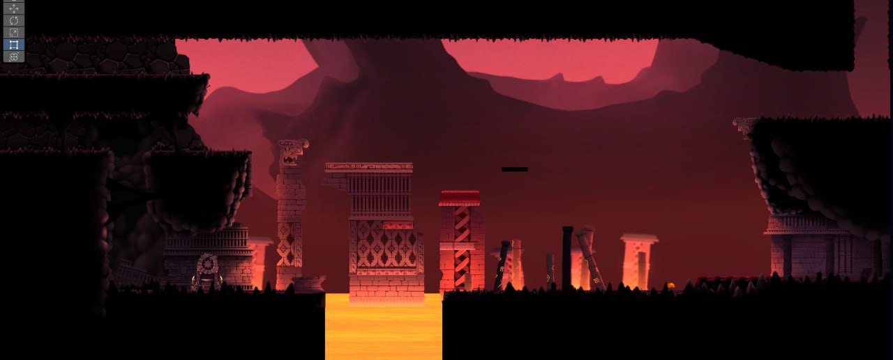
  </a>
  <a href="images/photo_2024-08-11_20-02-43.jpg" target="_blank">
    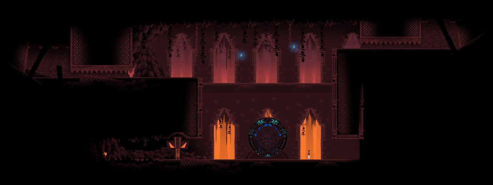
  </a>
  <a href="images/photo_2023-07-01_21-42-16.jpg" target="_blank">
    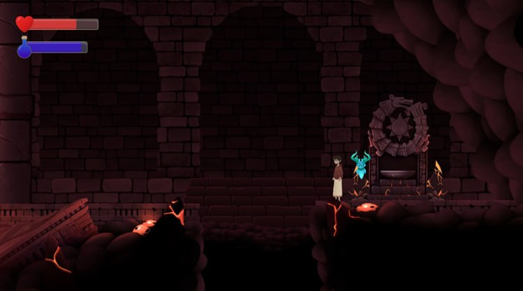
  </a>

  <iframe width="560" height="315" src="https://www.youtube.com/embed/l5HTd_IAmmI" title="Vivo entre Los Muertos — Teaser" frameborder="0" allow="accelerometer; autoplay; clipboard-write; encrypted-media; gyroscope; picture-in-picture; web-share" allowfullscreen></iframe>

  <iframe width="560" height="315" src="https://www.youtube.com/embed/jOMC-22at2g" title="Vivo entre Los Muertos — Art" frameborder="0" allow="accelerometer; autoplay; clipboard-write; encrypted-media; gyroscope; picture-in-picture; web-share" allowfullscreen></iframe>

  <iframe width="560" height="315" src="https://www.youtube.com/embed/caZvm6MS2JQ" title="Vivo entre Los Muertos — Movement" frameborder="0" allow="accelerometer; autoplay; clipboard-write; encrypted-media; gyroscope; picture-in-picture; web-share" allowfullscreen></iframe>

  <iframe width="560" height="315" src="https://www.youtube.com/embed/L2x1uiXZY7k" title="Vivo entre Los Muertos — Puzzle Gameplay" frameborder="0" allow="accelerometer; autoplay; clipboard-write; encrypted-media; gyroscope; picture-in-picture; web-share" allowfullscreen></iframe>

  Official Steam page: 
  <a href="https://store.steampowered.com/app/1058600/VeLM/" target="_blank" rel="noopener noreferrer">https://store.steampowered.com/app/1058600/VeLM/</a>

  
<strong>Potions of Proportions</strong> — Game Designer / Level Designer / Project Manager, Unity

  <h4>About the Project</h4>
  

    A 2D puzzle-platformer about creative size manipulation and spatial thinking. 
    Developed in Unity within 96 hours for the <strong>GMTK Game Jam 2024</strong> by a small team. 
    The game explores the mechanics of resizing characters and objects to solve platforming and logic challenges.
  

  <h4>Role and Responsibilities</h4>
  <ul>
    <li><strong>Game Design:</strong> designed the core resizing mechanic and its puzzle applications</li>
    <li><strong>Level Design:</strong> built progressive puzzle levels emphasizing spatial awareness and timing</li>
    <li><strong>Project Management:</strong> coordinated team workflow, tracked scope within jam constraints, and managed final build submission</li>
  </ul>

  <h4>Results</h4>
  <ul>
    <li>Completed and submitted a fully playable prototype within the 96-hour deadline</li>
    <li>Received positive feedback for originality and level pacing during the jam</li>
  </ul>

<h4>Project Materials</h4>

Screenshots and gameplay videos from the prototype:

  <a href="images/photo_(1300).png" target="_blank">
    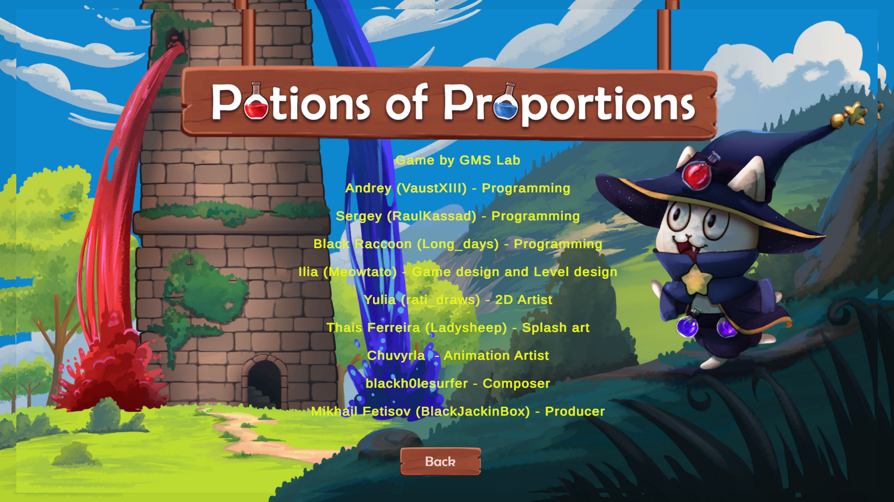
  </a>
  <a href="images/SmSHIP.jpg" target="_blank">
    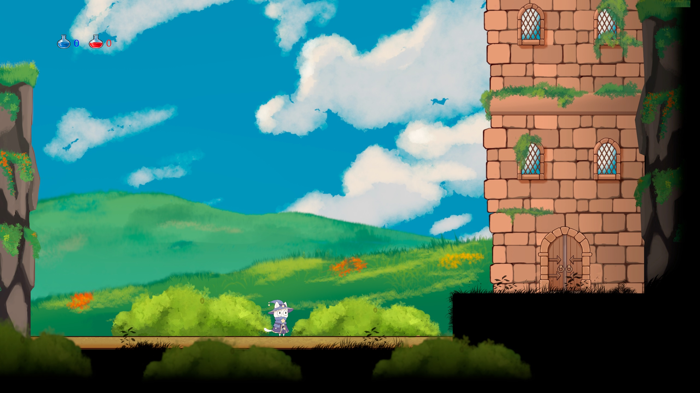
  </a>
  <a href="images/umLMMl.jpg" target="_blank">
    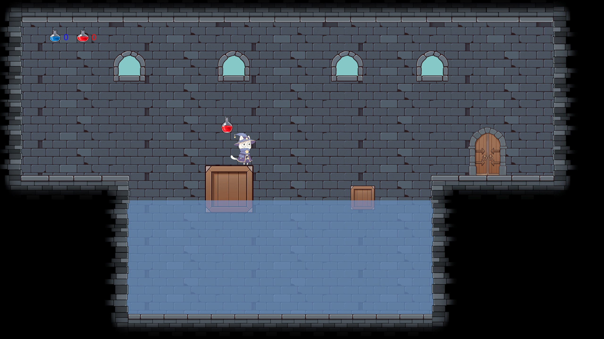
  </a>
  <a href="images/s__AfZ.jpg" target="_blank">
    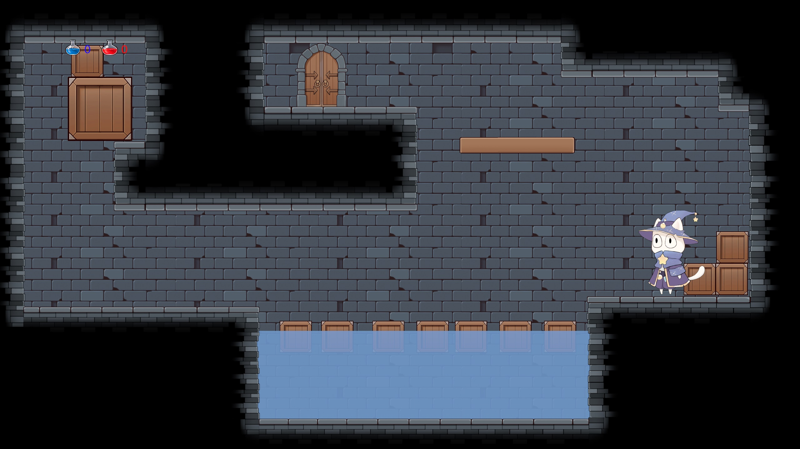
  </a>

  <iframe width="560" height="315" src="https://www.youtube.com/embed/Q5BbFcm-3LM" title="Potions of Proportions — Walkthrough" frameborder="0" allow="accelerometer; autoplay; clipboard-write; encrypted-media; gyroscope; picture-in-picture; web-share" allowfullscreen></iframe>

  Playable version available on itch.io: 
  <a href="https://blackjackinbox.itch.io/potions-of-proportions" target="_blank" rel="noopener noreferrer">https://blackjackinbox.itch.io/potions-of-proportions</a>

  
<strong>Bytes</strong> — Level Designer, Unity

  <h4>About the Project</h4>
  

    A short cyberpunk-themed prototype developed as part of the <strong>Arizona State University Video Game Development Club</strong>. 
    Initially planned as a cyberpunk rogue-like, the project evolved into a simple room-exploration game focused on movement and environment transitions. 
    Created as a learning experience emphasizing scope control and teamwork.
  

  <h4>Role and Responsibilities</h4>
  <ul>
    <li><strong>Level Design:</strong> created interconnected room layouts supporting exploration and pacing</li>
    <li>Worked closely with the design team to prototype spatial flow and navigation readability</li>
  </ul>

  <h4>Results</h4>
  <ul>
    <li>Developed a functional level structure demonstrating progression and spatial logic</li>
    <li>Contributed to an educational project highlighting lessons in scope management and iteration</li>
  </ul>

  <h4>Project Materials</h4>

  

    <a href="images/3.png" target="_blank">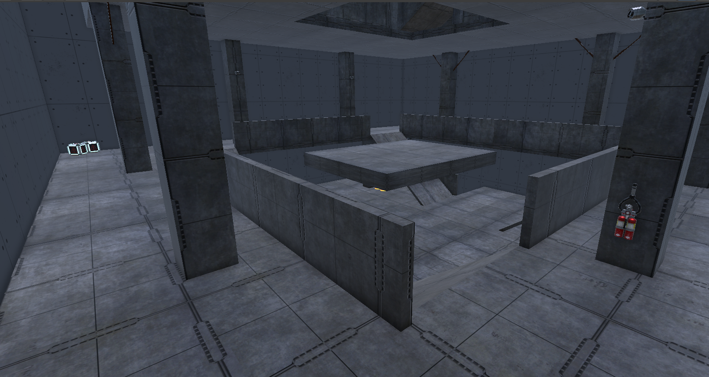</a>
    <a href="images/5.png" target="_blank">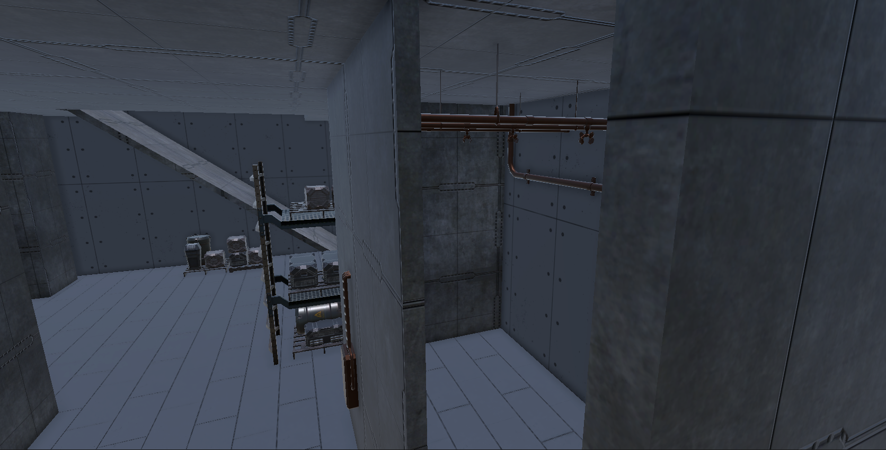</a> 
    <a href="images/7.png" target="_blank">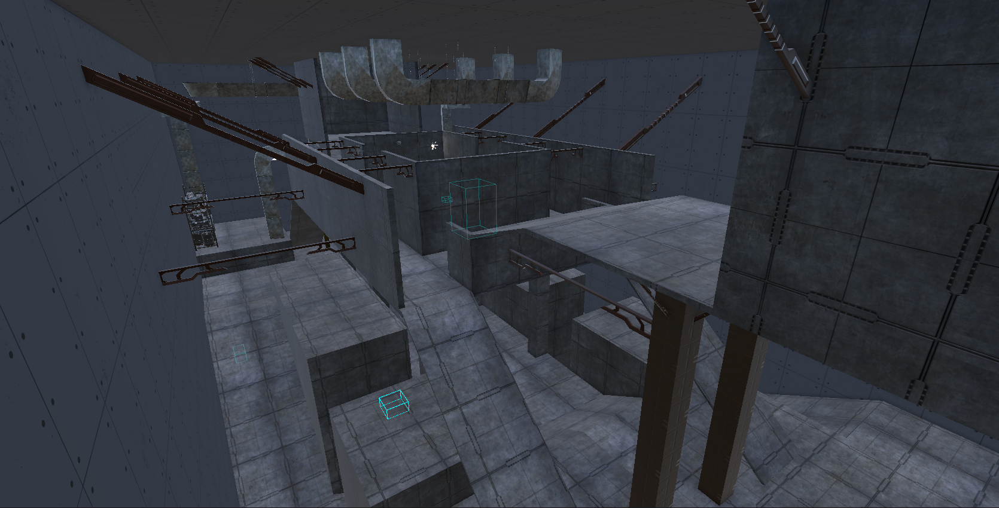</a>
    <a href="images/8.png" target="_blank">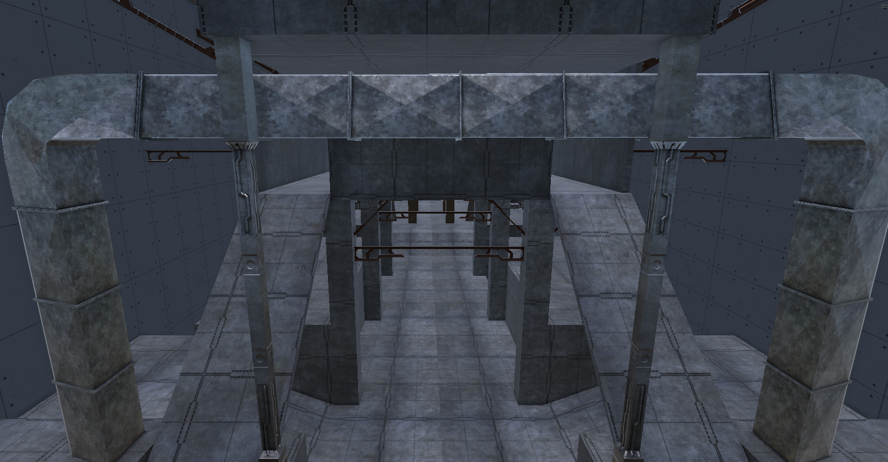</a>
  

  

    <iframe width="560" height="315" src="https://www.youtube.com/embed/ZYxe4WO4R_Y" title="Bytes — Gameplay Demo" frameborder="0" allow="accelerometer; autoplay; clipboard-write; encrypted-media; gyroscope; picture-in-picture; web-share" allowfullscreen></iframe>
  

  

    Playable version available on itch.io: 
    <a href="https://heatwave-studios.itch.io/bytes" target="_blank" rel="noopener noreferrer">https://heatwave-studios.itch.io/bytes</a>
  

---

### Localization Projects

  
<strong>Numeral Strike</strong> — Localization (RU→EN, RU→JA) / Localization QA

  <h4>About the Project</h4>
  

    Turn-based tactical roguelike available on Steam (demo version). 
    Provided <strong>Russian-to-English</strong> and <strong>Russian-to-Japanese localization</strong> for the demo build, 
    as well as <strong>localization quality assurance</strong> to ensure consistency, terminology accuracy, and clear gameplay communication across languages.
  

  <h4>Project Page</h4>
  

    Steam: 
    <a href="https://store.steampowered.com/app/3708620/Numeral_Strike/" target="_blank" rel="noopener noreferrer">
      https://store.steampowered.com/app/3708620/Numeral_Strike/
    </a>
  

  
<strong>Slay or Fall</strong> — Localization (RU→EN, RU→JA) / Localization QA

  <h4>About the Project</h4>
  

    2D roguelike available on Steam. 
    Provided <strong>Russian-to-English</strong> and <strong>Russian-to-Japanese localization</strong> for in-game text, UI, and gameplay terminology, 
    as well as <strong>localization quality assurance</strong> for consistency and readability across versions.
  

  <h4>Project Page</h4>
  

    Steam: 
    <a href="https://store.steampowered.com/app/3170730/Slay_or_Fall/" target="_blank" rel="noopener noreferrer">
      https://store.steampowered.com/app/3170730/Slay_or_Fall/
    </a>
  

  
<strong>Graces: Posthumous Wish</strong> — Localization (RU→JA) / Localization QA

  <h4>About the Project</h4>
  

    Visual novel released on Steam. 
    Provided <strong>Russian-to-Japanese localization</strong> for all in-game text and UI, 
    as well as <strong>localization quality assurance</strong> to ensure tone accuracy and linguistic consistency.
  

  <h4>Project Page</h4>
  

    Steam: 
    <a href="https://store.steampowered.com/app/2899980" target="_blank" rel="noopener noreferrer">
      https://store.steampowered.com/app/2899980
    </a>
  

  
<strong>Welcome to the Karoshi Club</strong> — Localization QA (RU→JA)

  <h4>About the Project</h4>
  

    Visual novel released on Steam. 
    Provided <strong>localization quality assurance</strong> for in-game text and UI.
  

  <h4>Project Page</h4>
  

    Steam: 
    <a href="https://store.steampowered.com/app/2624950/Welcome_to_the_Karoshi_Club/" target="_blank" rel="noopener noreferrer">
      https://store.steampowered.com/app/2624950/Welcome_to_the_Karoshi_Club/
    </a>
  

---

## Links
- [GitHub Profile](https://github.com/BlackJackinBox)  
- [Itch.io](https://blackjackinbox.itch.io)
- 📧 Email: blackjackinbox@gmail.com
