# Mikhail Fetisov Game Designer (Generalist)
<!--
This repository hosts my personal resume and portfolio site, available at:  
👉 [https://blackjackinbox.github.io](https://blackjackinbox.github.io)
-->
## About Me
Experienced Game Designer with a strong background in **systems, content, and narrative-driven gameplay design**.
Hands-on experience working with Unity and Unreal Engine projects, contributing to gameplay systems, mechanics iteration, porting, and localization workflows.
Focused on creating engaging player experiences through systemic design and improving cross-disciplinary development workflows.

**Age**: 36

**Location**: Moscow, willing to relocate

**Languages**:

- Russian (native)
- English (C1)
- Japanese (JLPT N3)

**Game Preferences**

I draw inspiration from **2D platformers, CRPGs, and strategy games**.  
Favorite titles include:

- *Hollow Knight* (level & world structure, tight 2D combat loop)
- *The Witcher 3* (narrative design and meaningful player choices)
- *Heroes of Might and Magic III / Frostpunk / Against the Storm* (macro decision-making and systemic storytelling)

**Hobbies**:
Outside of Game Design, I play drums in a music band: teamwork, rhythm and iteration are also part of my creative process.

---

## Focus Areas
- Systems, content, and narrative-driven gameplay design
- Gameplay mechanics balancing, iteration, and tuning
- PC and web-based games (action, strategy, metroidvania)
- International collaboration and localization-sensitive development

**Tools:** Unity, Unreal Engine 5, Git, Jira, Confluence, Figma, Trello, Google Sheets / Excel, Blender, AI-assisted tools (ChatGPT, Claude, Midjourney)

---

## Resume
📄 [Download my Resume (PDF)](/Resume_Mikhail_Fetisov.pdf)

---

## Case Studies

### Game Design Projects

  
<strong>Dungeon Dominator</strong>: System Designer / Content Designer, UE5

  <h4>About the Project:</h4>
  

    A dark-fantasy <strong>dungeon management strategy game for PC</strong> developed in Unreal Engine 5. 
    The game combines dungeon building, resource management, creature management, real-time combat, and direct player interaction with the environment. 
    Worked within a small cross-functional team during pre-production and production.
  

  <h4>Role and Responsibilities:</h4>
  <ul>
    <li>Designed core player–world interaction mechanics, meta-progression, economy, and event logic</li>
    <li>Structured and maintained game design documentation for gameplay systems and content, ensuring clear requirements were communicated to programmers, UI designers, and the content team</li>
    <li>Created and maintained balance sheets for the economy and progression systems, tuning key parameters and dependencies</li>
    <li>Coordinated content and UI integration: defined requirements and verified correct data presentation and interaction between gameplay systems and the interface</li>
  </ul>

  <h4>Results:</h4>
  <ul>
    <li>Established a unified structure for documentation and balance sheets across several interconnected gameplay systems</li>
    <li>Streamlined communication of requirements between design, programming, and UI by formalizing system dependencies and parameters</li>
  </ul>

  <h4>Project Materials</h4>
  

    Official Steam page: 
    <a href="https://store.steampowered.com/app/3664020/Dungeon_Dominator/" target="_blank" rel="noopener noreferrer">https://store.steampowered.com/app/3664020/Dungeon_Dominator/</a>
  

  
<strong>Vivo entre Los Muertos (VeLM)</strong>: System Designer / Level Designer / Project Manager, Unity

  <h4>About the Project</h4>
  

    A 2D side-scrolling <strong>metroidvania</strong> inspired by <em>Pitfall</em>, <em>Ori</em>, and <em>Hollow Knight</em>, set in a <strong>Mesoamerican-inspired world</strong>. 
    Developed in Unity as a passion project without external funding. 
    The design included seven planned biomes, multiple boss encounters, and an emphasis on exploration and environmental storytelling.
  

  <h4>Role and Responsibilities</h4>
  <ul>
    <li><strong>System Design:</strong> designed progression systems, player abilities, combat and resource mechanics</li>
    <li><strong>Level Design:</strong> created side-scrolling maps and gameplay flow for exploration and combat areas</li>
    <li><strong>Project Management:</strong> coordinated a small distributed team of artists and programmers, maintained development roadmap, feature priorities, and production milestones</li>
  </ul>

  <h4>Results</h4>
  <ul>
    <li>Completed a nearly finished <strong>vertical slice prototype</strong> showcasing core gameplay</li>
    <li>Fully developed and content-complete biome <strong>“House of Fire”</strong> with unique mechanics and visual identity</li>
  </ul>

<h4>Project Materials</h4>

Screenshots and gameplay videos from the prototype:

  <a href="images/photo_2023-06-26_15-11-11.jpg"
     class="glightbox"
     data-gallery="velm">
    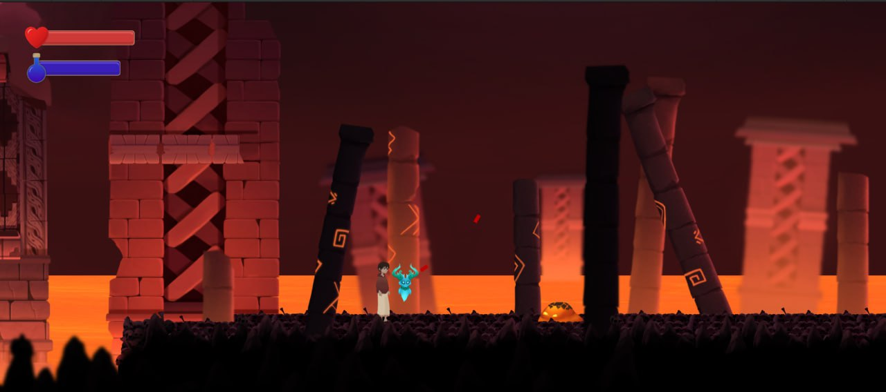
  </a>

  <a href="images/photo_2024-03-14_19-17-08.jpg"
     class="glightbox"
     data-gallery="velm">
    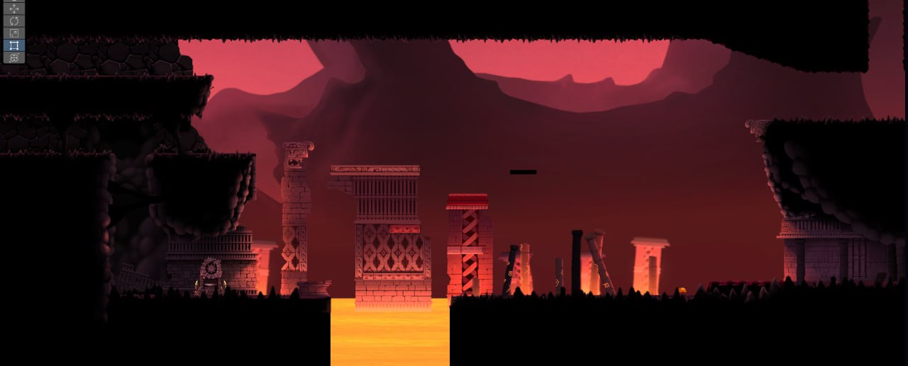
  </a>

  <a href="images/photo_2024-08-11_20-02-43.jpg"
     class="glightbox"
     data-gallery="velm">
    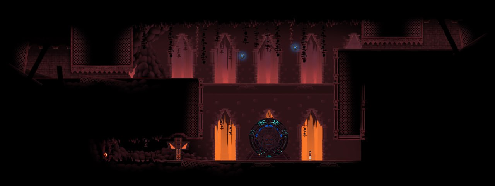
  </a>

  <a href="images/photo_2023-07-01_21-42-16.jpg"
     class="glightbox"
     data-gallery="velm">
    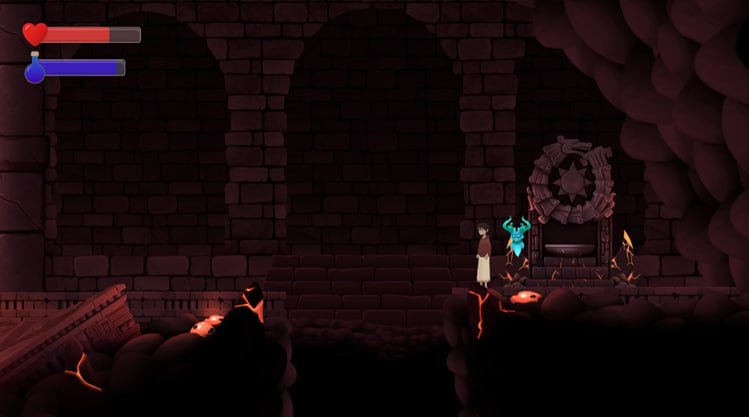
  </a>

  

  

  

  

  Official Steam page: 
  <a href="https://store.steampowered.com/app/1058600/VeLM/" target="_blank" rel="noopener noreferrer">https://store.steampowered.com/app/1058600/VeLM/</a>

  
<strong>Potions of Proportions</strong>: Game Designer / Level Designer / Project Manager, Unity

  <h4>About the Project</h4>
  

    A 2D puzzle-platformer about creative size manipulation and spatial thinking. 
    Developed in Unity within 96 hours for the <strong>GMTK Game Jam 2024</strong> by a small team. 
    The game explores the mechanics of resizing characters and objects to solve platforming and logic challenges.
  

  <h4>Role and Responsibilities</h4>
  <ul>
    <li><strong>Game Design:</strong> designed the core resizing mechanic and its puzzle applications</li>
    <li><strong>Level Design:</strong> built progressive puzzle levels emphasizing spatial awareness and timing</li>
    <li><strong>Project Management:</strong> coordinated team workflow, tracked scope within jam constraints, and managed final build submission</li>
  </ul>

  <h4>Results</h4>
  <ul>
    <li>Completed and submitted a fully playable prototype within the 96-hour deadline</li>
    <li>Received positive feedback for originality and level pacing during the jam</li>
  </ul>

<h4>Project Materials</h4>

Screenshots and gameplay videos from the prototype:

  <a href="images/photo_(1300).png"
     class="glightbox"
     data-gallery="potions">
    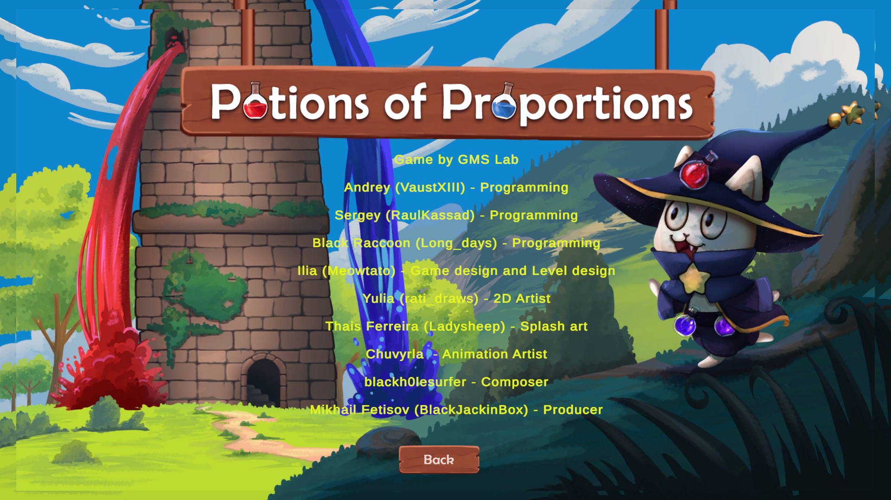
  </a>

  <a href="images/SmSHIP.jpg"
     class="glightbox"
     data-gallery="potions">
    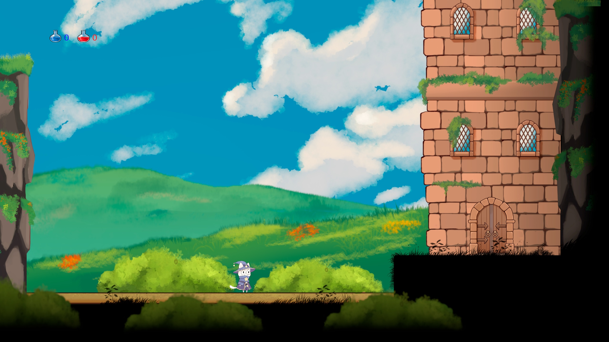
  </a>

  <a href="images/umLMMl.jpg"
     class="glightbox"
     data-gallery="potions">
    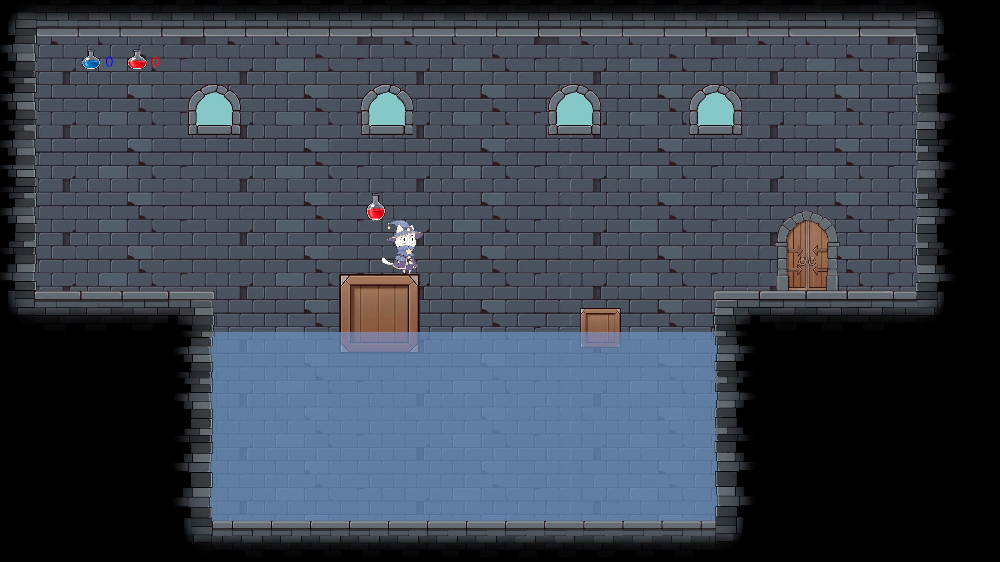
  </a>

  <a href="images/s__AfZ.jpg"
     class="glightbox"
     data-gallery="potions">
    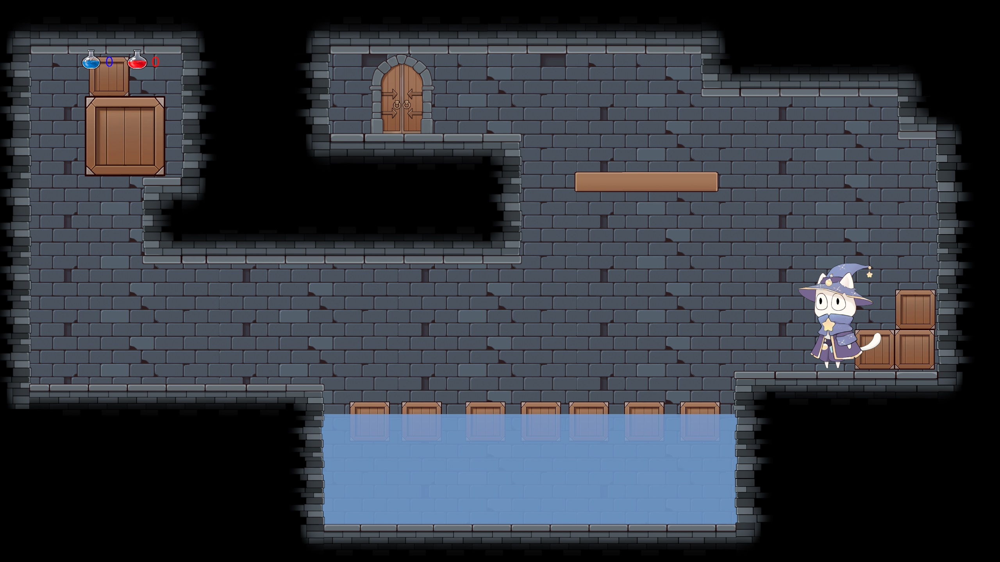
  </a>

  

  Playable version available on itch.io: 
  <a href="https://blackjackinbox.itch.io/potions-of-proportions" target="_blank" rel="noopener noreferrer">https://blackjackinbox.itch.io/potions-of-proportions</a>

  
<strong>Bytes</strong>: Level Designer, Unity

  <h4>About the Project</h4>
  

    A short cyberpunk-themed prototype developed as part of the <strong>Arizona State University Video Game Development Club</strong>. 
    Initially planned as a cyberpunk rogue-like, the project evolved into a simple room-exploration game focused on movement and environment transitions. 
    Created as a learning experience emphasizing scope control and teamwork.
  

  <h4>Role and Responsibilities</h4>
  <ul>
    <li><strong>Level Design:</strong> created interconnected room layouts supporting exploration and pacing</li>
    <li>Worked closely with the design team to prototype spatial flow and navigation readability</li>
  </ul>

  <h4>Results</h4>
  <ul>
    <li>Developed a functional level structure demonstrating progression and spatial logic</li>
    <li>Contributed to an educational project highlighting lessons in scope management and iteration</li>
  </ul>

  <h4>Project Materials</h4>

  <a href="images/3.png"
     class="glightbox"
     data-gallery="bytes">
    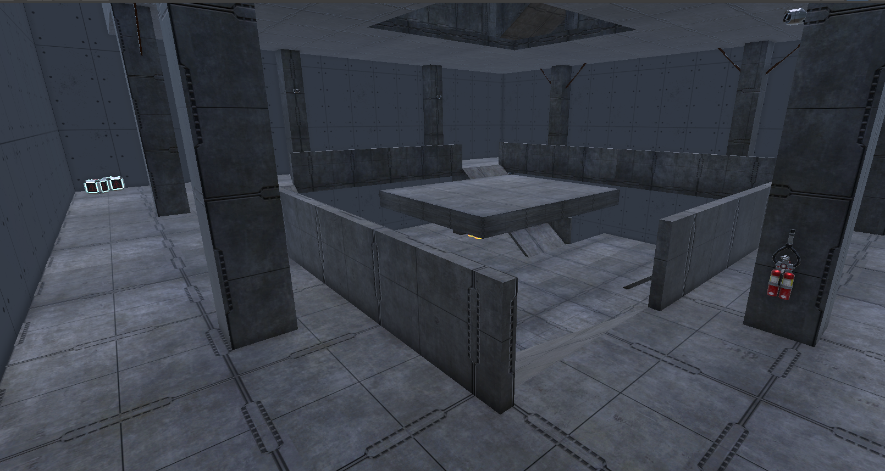
  </a>

  <a href="images/5.png"
     class="glightbox"
     data-gallery="bytes">
    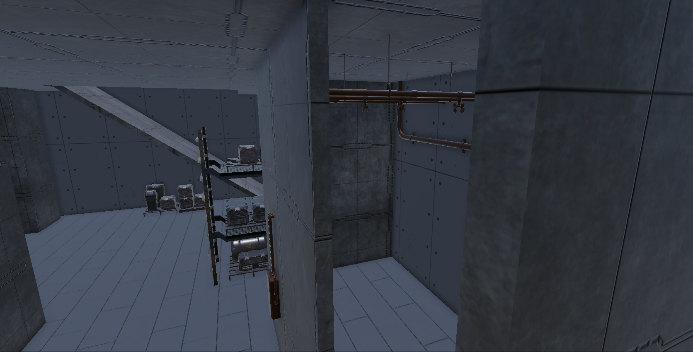
  </a> 

  <a href="images/7.png"
     class="glightbox"
     data-gallery="bytes">
    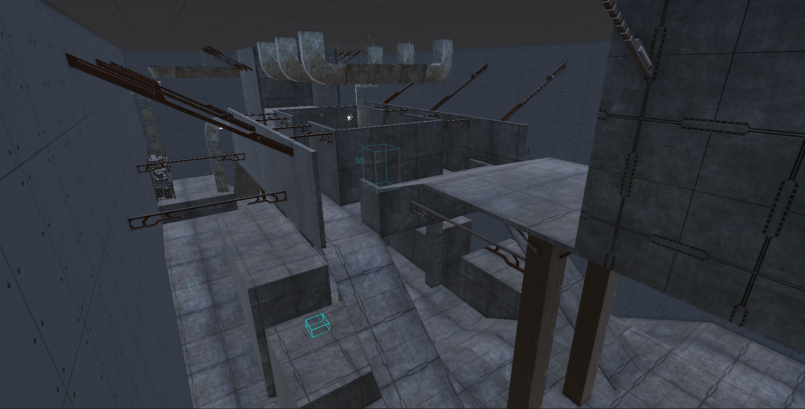
  </a>

  <a href="images/8.png"
     class="glightbox"
     data-gallery="bytes">
    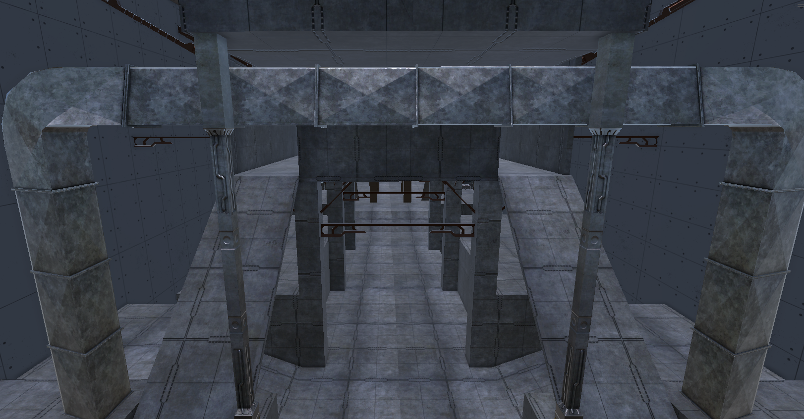
  </a>

  

  

    Playable version available on itch.io: 
    <a href="https://heatwave-studios.itch.io/bytes" target="_blank" rel="noopener noreferrer">https://heatwave-studios.itch.io/bytes</a>
  

 

  
<strong>Commercial 18+ Projects</strong>

  

    <em>
      The following projects contain adult content (18+).
      Portfolio materials are presented in a safe-for-work format and focus on game design, gameplay systems, narrative, and production responsibilities.
    </em>
  

  
<strong>SQUIRT GAME 💦</strong>: System Designer / Narrative Designer / Content Designer, Unity

  <h4>About the Project</h4>
  

    An <strong>18+ visual novel with puzzle adventure, point-and-click, and dating sim elements</strong>, set within an online reality show. 
    The gameplay combines location exploration, character interactions, mini-games, and puzzles, while player choices affect relationships, narrative branches, and available scenes. 
    Worked on the project in Unity as part of a small team, contributing to gameplay systems, narrative design, and content production.
  

  <h4>Role and Responsibilities</h4>
  <ul>
    <li>Designed the overall progression structure, including the sequence of narrative events, quests, and their unlock conditions</li>
    <li>Developed narrative content, dialogue, character interactions, and branching scenarios based on player choices</li>
    <li>Designed and configured mini-games, interactive sequences, and related progression systems</li>
    <li>Worked directly in Unity and Naninovel, setting up gameplay scenes, event sequences, UI, camera behavior, video integration, and content implementation</li>
    <li>Created and maintained design documentation, content requirements, and technical specifications for programmers and artists</li>
  </ul>

  <h4>Results</h4>
  <ul>
    <li>Built a cohesive progression structure combining narrative events, exploration, mini-games, and character relationship systems</li>
    <li>Implemented and configured a significant portion of the project’s interactive and narrative content directly in the game engine</li>
    <li>Established a reusable workflow for integrating narrative scenes, interactive sequences, and additional content</li>
  </ul>

  <h4>Project Materials</h4>
  

    Steam page: 
    <a href="https://store.steampowered.com/app/5038160/SQUIRT_GAME/" target="_blank" rel="noopener noreferrer">https://store.steampowered.com/app/5038160/SQUIRT_GAME/</a>
  

  
<strong>Sexvirus.exe</strong>: System Designer / Narrative Designer / Content Designer, Unity

  <h4>About the Project</h4>
  

    An <strong>18+ inspection game with border-control simulation elements</strong>, set inside a computer system. 
    The player inspects incoming programs, compares their data against a database, identifies viruses, and decides whether to allow them through, destroy the infected carrier, or send a special virus to quarantine. 
    Across seven in-game days, the inspection system gradually becomes more complex, progressing from visual identification to document checks, carrier verification, and digital signature scanning.
  

  <h4>Role and Responsibilities</h4>
  <ul>
    <li>Designed the core gameplay loop around program inspection, decision-making, and outcome handling</li>
    <li>Designed the progression of gameplay mechanics across seven in-game days, gradually introducing new inspection layers and increasing decision complexity</li>
    <li>Defined rules for normal programs, impostors, and named viruses, including different detection, destruction, and quarantine conditions</li>
    <li>Designed the logic and UX requirements for inspection tools, including database checks, documents, carrier parameters, license verification, and digital signature scanning</li>
    <li>Developed character arcs, dialogue, tutorials, and contextual reactions to player actions</li>
    <li>Created and maintained design documentation and technical requirements for programmers, artists, and animators</li>
    <li>Contributed directly to gameplay system and content setup in Unity</li>
  </ul>

  <h4>Results</h4>
  <ul>
    <li>Built a scalable gameplay loop in which the core inspection procedure is progressively expanded with additional mechanics</li>
    <li>Designed multiple categories of incoming programs with distinct behavior rules and decision conditions</li>
    <li>Connected systemic gameplay with character arcs and content progression while preserving a clear “inspection → decision → consequence” loop</li>
    <li>Established a tutorial and reaction structure that introduces new mechanics gradually without relying on a separate tutorial mode</li>
  </ul>

  <h4>Project Materials</h4>
  

    The project is currently in development. 
    A public project page is not yet available (TBA).
  

---

### Localization Projects

  
<strong>Numeral Strike</strong>: Localization (RU→EN, RU→JA, RU→DE) / Localization QA (RU→EN, RU→JA, RU→DE)

  <h4>About the Project</h4>
  

    Turn-based tactical roguelike available on Steam (demo version). 
    Provided <strong>Russian-to-English</strong>, <strong>Russian-to-German</strong>, and <strong>Russian-to-Japanese localization</strong> for the release build, 
    as well as <strong>localization quality assurance</strong> to ensure consistency, terminology accuracy, and clear gameplay communication across languages.
  

    <h4>Screenshots</h4>

  <a href="images/NS_1.png"
     class="glightbox"
     data-gallery="numeral-strike">
    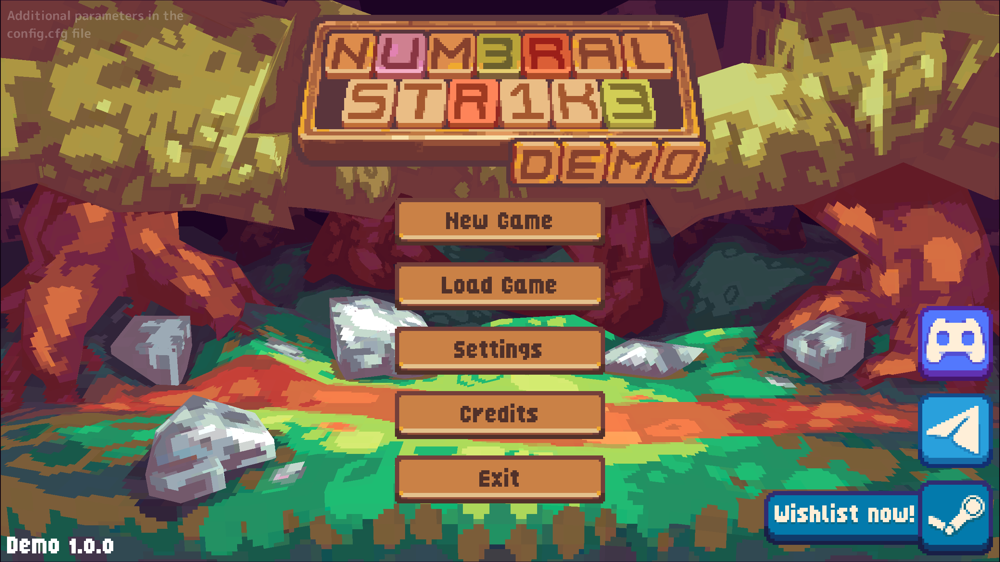
  </a>

  <a href="images/NS_3.png"
     class="glightbox"
     data-gallery="numeral-strike">
    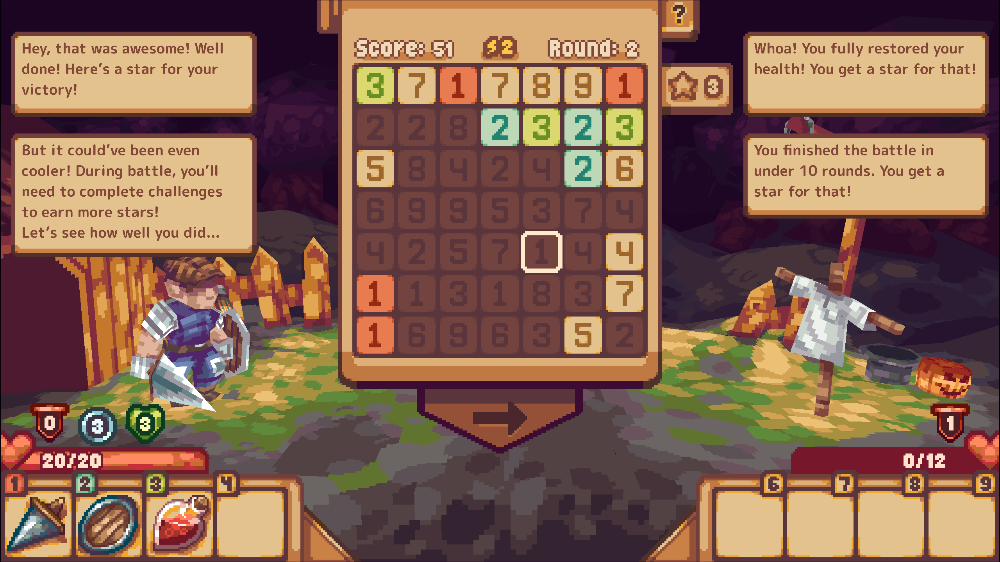
  </a> 

  <a href="images/NS_6.png"
     class="glightbox"
     data-gallery="numeral-strike">
    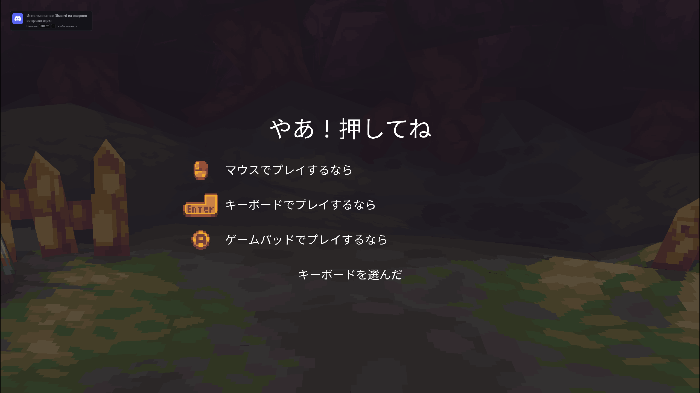
  </a>

  <a href="images/NS_5.png"
     class="glightbox"
     data-gallery="numeral-strike">
    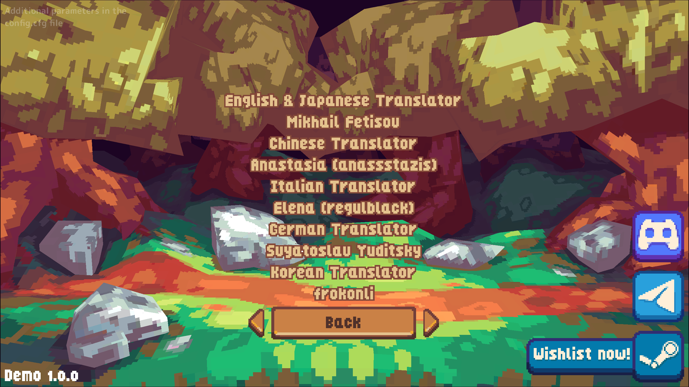
  </a>

  <h4>Project Page</h4>
  

    Steam: 
    <a href="https://store.steampowered.com/app/3708620/Numeral_Strike/" target="_blank" rel="noopener noreferrer">
      https://store.steampowered.com/app/3708620/Numeral_Strike/
    </a>
  

  
<strong>Slay or Fall</strong>: Localization (RU→EN, RU→JA) / Localization QA (RU→EN, RU→JA)

  <h4>About the Project</h4>
  

    2D roguelike available on Steam. 
    Provided <strong>Russian-to-English</strong> and <strong>Russian-to-Japanese localization</strong> for in-game text, UI, and gameplay terminology, 
    as well as <strong>localization quality assurance</strong> for consistency and readability across versions.
  

      <h4>Screenshots</h4>

  <a href="images/Slay_1.png"
     class="glightbox"
     data-gallery="slay-or-fall">
    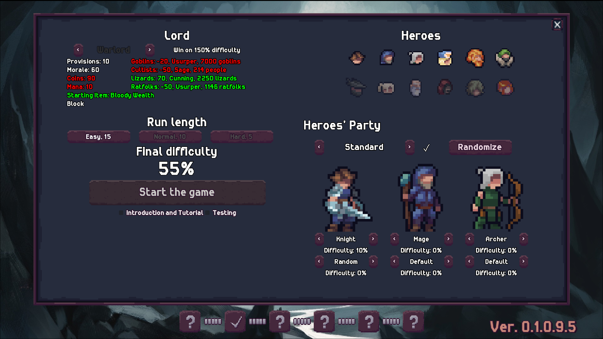
  </a>

  <a href="images/Slay_7.png"
     class="glightbox"
     data-gallery="slay-or-fall">
    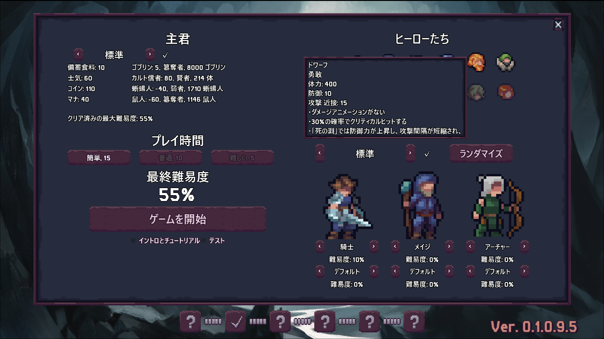
  </a> 

  <a href="images/Slay_4.png"
     class="glightbox"
     data-gallery="slay-or-fall">
    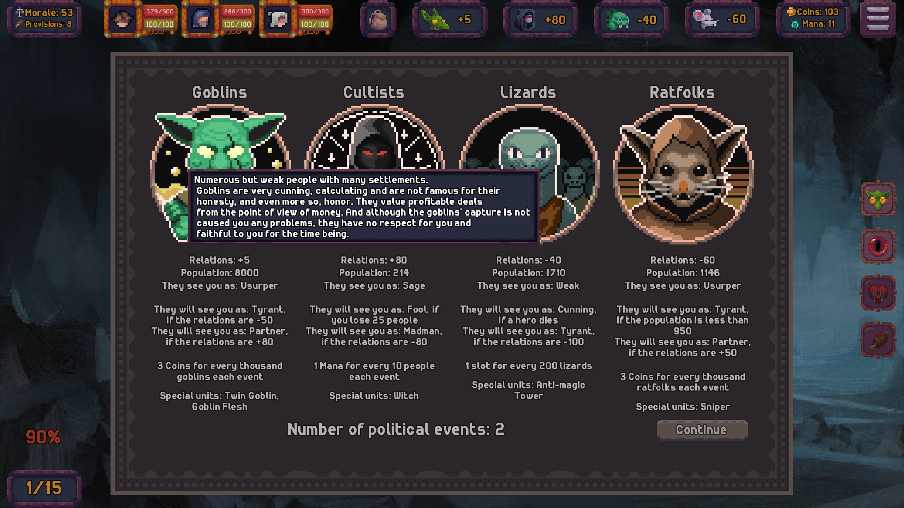
  </a>

  <a href="images/Slay_12.png"
     class="glightbox"
     data-gallery="slay-or-fall">
    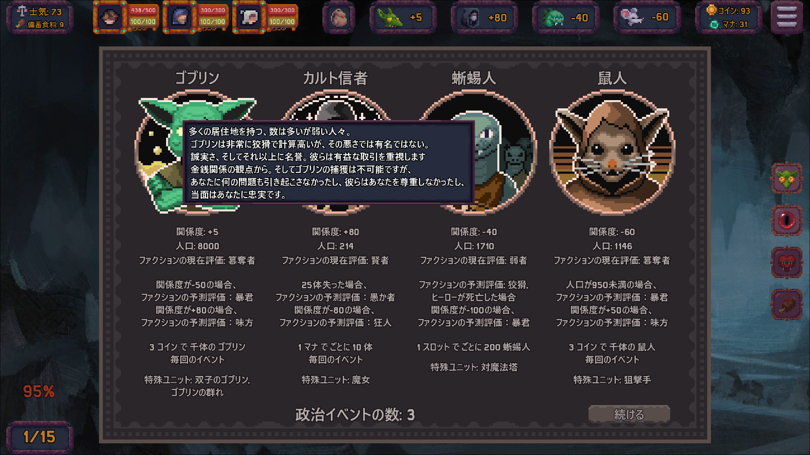
  </a>

  <h4>Project Page</h4>
  

    Steam: 
    <a href="https://store.steampowered.com/app/3170730/Slay_or_Fall/" target="_blank" rel="noopener noreferrer">
      https://store.steampowered.com/app/3170730/Slay_or_Fall/
    </a>
  

  
<strong>Graces: Posthumous Wish</strong>: Localization (RU→JA) / Localization QA (RU→JA)

  <h4>About the Project</h4>
  

    Visual novel released on Steam. 
    Provided <strong>Russian-to-Japanese localization</strong> for all in-game text and UI, 
    as well as <strong>localization quality assurance</strong> to ensure tone accuracy and linguistic consistency.
  

  
      <h4>Screenshots</h4>

  <a href="images/Graces_1.png"
     class="glightbox"
     data-gallery="graces">
    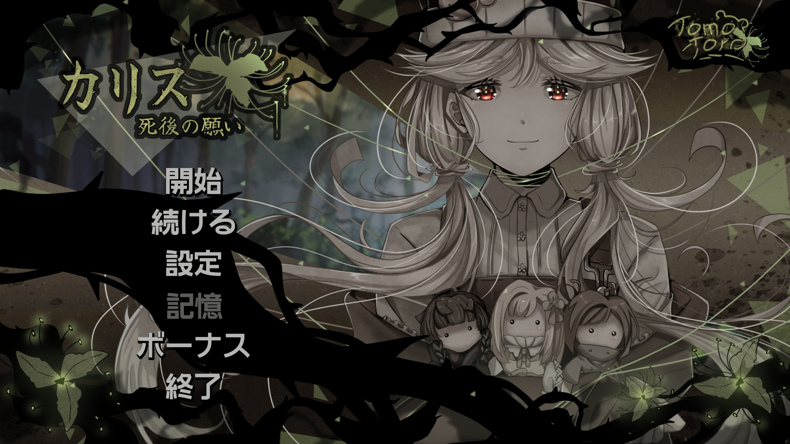
  </a>

  <a href="images/Graces_5.png"
     class="glightbox"
     data-gallery="graces">
    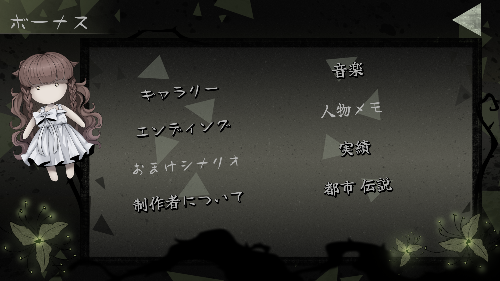
  </a> 

  

  <a href="images/Graces_4.png"
     class="glightbox"
     data-gallery="graces">
    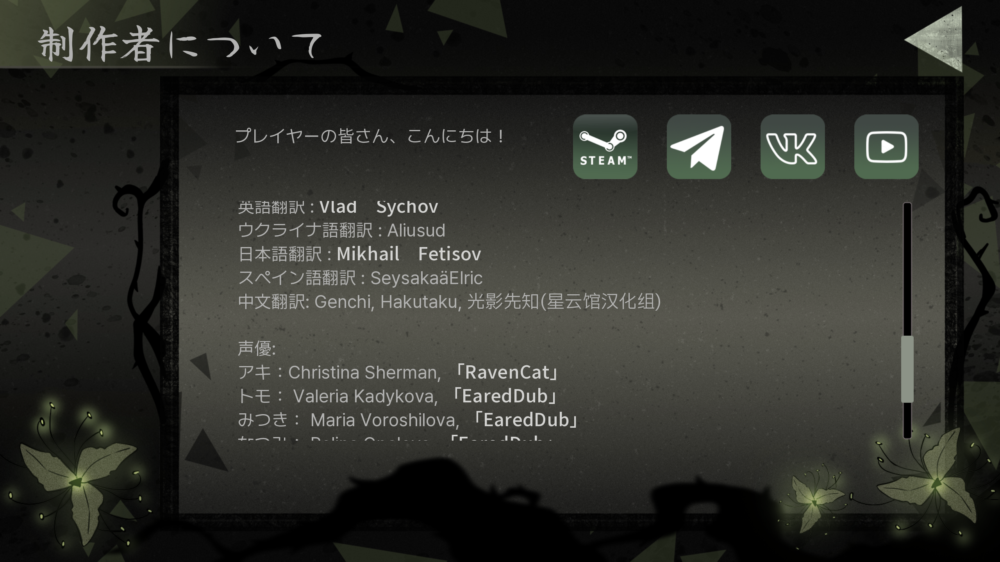
  </a>

  <h4>Project Page</h4>
  

    Steam: 
    <a href="https://store.steampowered.com/app/2899980" target="_blank" rel="noopener noreferrer">
      https://store.steampowered.com/app/2899980
    </a>
  

  
<strong>Welcome to the Karoshi Club</strong>: Localization QA (RU→JA)

  <h4>About the Project</h4>
  

    Visual novel released on Steam. 
    Provided <strong>localization quality assurance</strong> for in-game text and UI.
  

  <h4>Project Page</h4>
  

    Steam: 
    <a href="https://store.steampowered.com/app/2624950/Welcome_to_the_Karoshi_Club/" target="_blank" rel="noopener noreferrer">
      https://store.steampowered.com/app/2624950/Welcome_to_the_Karoshi_Club/
    </a>
  

---

## Links
- [GitHub](https://github.com/BlackJackinBox)  
- [Itch.io](https://blackjackinbox.itch.io)
- [ArtStation](https://www.artstation.com/blackjackinbox)
- Email: blackjackinbox@gmail.com